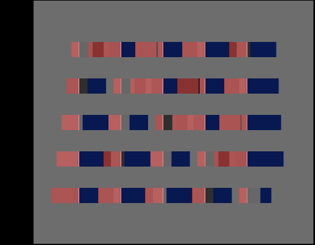
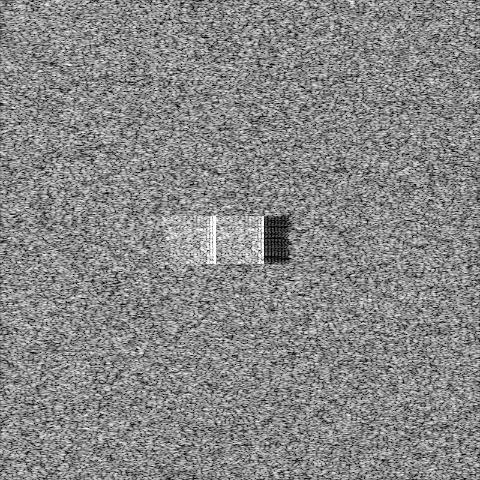
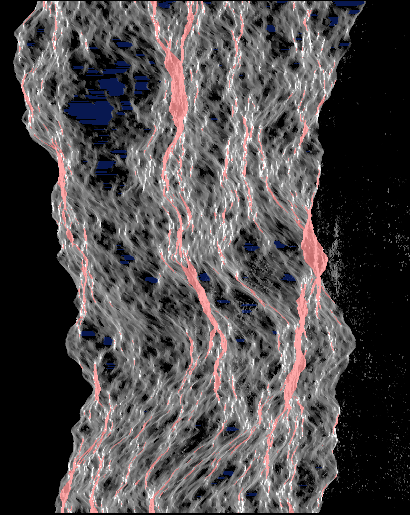

# backscatter

**A physically based SAR ray tracer in modern C++.** Give it a 3-D scene
(terrain from a real elevation model, plus buildings) and a satellite orbit, and it
renders the image a radar satellite such as Sentinel-1 would capture. That includes
the effects that make SAR look strange: layover, foreshortening, radar shadow,
double bounce from buildings, and speckle.

| Geometric mode: synthetic city | Coherent mode: one building, backprojected | Geometric mode: fractal mountains |
|---|---|---|
|  |  |  |
| Slant range →, azimuth ↓. Layover tinted red, shadow blue; the thin bright lines are double bounce at wall feet. | 0.5 m pixels on the ground. From left to right: wall layover in front of the building, the double-bounce line at its foot, the roof, then shadow. Speckle comes from the physics; nobody painted it on. | Red ridges are layover on slopes steeper than the 35° incidence angle. |

## Two modes

1. **Geometric / radiometric.** Rays are cast in each azimuth line's zero-Doppler
   plane and followed through specular bounces. Every hit that can see the sensor
   is binned by *slant range* (half the round-trip path length) instead of by
   screen pixel. The output is a β⁰ image, per-bounce-order images, and layover and
   shadow masks. It is fast and deterministic.
2. **Coherent.** Sub-resolution scatterers on every facet, plus multi-bounce paths,
   carry complex amplitude with phase −4πR/λ. The renderer synthesises the raw
   chirp echoes a radar would record, range-compresses them with a matched filter,
   and focuses them by time-domain backprojection, optionally straight onto the
   DEM.

## Validation against theory

Every number below is produced by `bsar_eval theory`
([full report with commit and machine](docs/theory_results.md)). The same checks
run as unit tests in CI.

| Check | Result | Theory | Criterion |
|---|---|---|---|
| Range resolution (−3 dB, 100 MHz chirp) | 1.3292 m | 1.3279 m | **+0.10%** (within 5%) |
| Azimuth resolution (−3 dB, 2 m antenna) | 0.8840 m | 0.8859 m | **−0.21%** (within 5%) |
| PSLR, range / azimuth | −13.34 / −13.30 dB | −13.26 dB | within 1 dB |
| Speckle, single look | ENL **0.984**; KS D* = 0.37 | exponential, ENL 1 | ENL 1 ± 0.15; KS not rejected at 1% |
| Layover / shadow on 6 ridges around the closed-form thresholds | 6 / 6 correct | α > θ / α > 90° − θ | exact |
| Dihedral double-bounce range | 0.30 m from the corner range | corner range | within one 1 m bin |
| 1 vs. 20 threads | bit-identical (geometric and coherent) | | bit-identical |

Real-data validation against Sentinel-1 is the next phase. Its protocol (geographic
held-out tiles, metrics, thresholds) is in [docs/validation.md](docs/validation.md),
and [docs/prereg.md](docs/prereg.md) is to be committed before any real scene is
rendered.

## Performance

See [docs/benchmarks.md](docs/benchmarks.md), generated by
`scripts/run_benchmarks.py` with the commit, CPU and compiler recorded.

Highlights (i9-13900H, 20 threads, Clang 21, commit `1194b4b`):

* **BVH build:** 2.1 M-triangle terrain in 1.5 s with binned SAH (SAH cost
  28.1, vs. 30.7 for an object-median split).
* **Traversal:** SAR-geometry closest-hit rays on one thread reach 5.5 Mrays/s
  with the 4-wide SSE BVH in render order (2.6 with the binary BVH; 1.45 in
  cache-hostile random order). On 20 threads it reaches 24 Mrays/s (83% parallel
  efficiency).
* **Full render:** a 3-bounce geometric render of that terrain (2051 × 1992
  bins, 22 M primary rays plus shadow and bounce rays) takes 1.2 s.
* **Backprojection:** 374 M pixel·pulses/s on 20 threads (10.6× over one).
  Cache blocking alone gains nothing yet: the kernel is bound by `sqrt`/`sincos`,
  which is what the SIMD work targets next.
* **Not done yet:** the comparison against Intel Embree and 8-wide AVX2 traversal.

## Building

Requirements: a C++20 compiler, CMake ≥ 3.21 and Ninja. Development so far has
used Clang 21 (via Zig 0.16) on Windows; CI is set up for GCC 14 and Clang 18 on
Ubuntu. Catch2 is fetched automatically if not installed. GDAL is optional, for
GeoTIFF DEMs.

```bash
cmake --preset release            # or: native (-march=native), debug, asan, gdal
cmake --build --preset release
ctest --preset release
```

## Usage

```bash
# Geometric render of a synthetic scene from a Sentinel-1-like straight track
build/release/apps/bsar_render --scene city --range-spacing 1 --azimuth-spacing 2 --out renders/city

# Coherent airborne simulation, focused onto the scene surface
build/release/apps/bsar_render --scene dihedral --mode coherent --platform airborne --density 2 --out renders/dihedral

# Ray-traced hillshade (comparable to `gdaldem hillshade`)
build/release/apps/bsar_render --scene dem:data/raw/eiger.asc --geographic --mode hillshade

# A real DEM and a real Sentinel-1 orbit
python data/fetch_dem.py --lat 46 --lon 7 --bbox 7.95 46.53 8.05 46.60 --ellipsoidal --out data/raw/eiger.asc
python data/fetch_orbit.py --mission S1A --time 2024-06-01T05:30:00
build/release/apps/bsar_render --scene dem:data/raw/eiger.asc --geographic \
    --orbit data/raw/S1A_OPER_AUX_POEORB_<...>.EOF --time 2024-06-01T05:30:00 --out renders/eiger

# Validation suite and image metrics
build/release/apps/bsar_eval theory
build/release/apps/bsar_eval iou renders/a_layover.npy renders/b_layover.npy
```

Outputs are PNG previews plus NumPy `.npy` arrays (rows = azimuth, columns =
slant range) and a `_meta.json` with the range/azimuth sampling.

### Python

```bash
cmake --preset release -DBSAR_BUILD_PYTHON=ON -DPython_EXECUTABLE=$(which python)   # needs: pip install nanobind numpy
cmake --build --preset release
```

```python
import numpy as np, backscatter
r = backscatter.render_heightmap(dem.astype(np.float32), cell_size=30.0, incidence=35.0)
r["intensity"], r["layover"], r["shadow"], r["bounce"][1]            # NumPy arrays
slc = backscatter.simulate_slc(dem.astype(np.float32), cell_size=1.0)  # complex64 SLC
```

## How it works

```
include/backscatter/
  math/       Vec3, AABB, Philox4x32 counter-based RNG, radix-2 FFT
  geometry/   SoA triangle mesh, watertight ray/triangle, binned-SAH BVH, 4-wide SSE BVH
  scene/      DEM loading (ESRI ASCII; GeoTIFF via GDAL), OSM footprint extrusion, materials
  sensor/     WGS84/ECEF/ENU, Sentinel-1 EOF orbits + Hermite interpolation, zero-Doppler solver, chirp
  trace/      geometric integrator, coherent scatterers + raw echo synthesis + range compression, hillshade
  image/      backprojection, PNG/NPY I/O
  eval/       IRF metrics (resolution, PSLR, ISLR), speckle statistics, mask IoU, theory checks
apps/         bsar_render, bsar_eval
bench/        bsar_bench (Markdown output)
python/       nanobind module
data/         scripts that fetch DEM / OSM / orbit data (nothing checked in)
docs/         design, SAR notes, scattering model, validation, pre-registration, dev log
```

* [docs/design.md](docs/design.md): frames and precision, BVH, both integrators,
  determinism, and every approximation made.
* [docs/sar_notes.md](docs/sar_notes.md): SAR on one page (range, azimuth,
  Doppler, backprojection, speckle).
* [docs/scattering.md](docs/scattering.md): the scattering model, material table
  with sources, and where the model is known to be wrong.
* [docs/devlog.md](docs/devlog.md): bugs found along the way, including FMA
  contraction breaking watertight intersection.

Engineering: C++20, CMake presets, no raw `new`/`delete` in the core, spans at
API boundaries, `-Wall -Wextra -Wpedantic -Wshadow -Wold-style-cast` clean.
CI runs GCC and Clang, ASan + UBSan, clang-tidy, clang-format, and a GDAL build.

## Status

Planned phases (see the project plan) and where each one stands:

- [x] **0. Groundwork:** repo, presets, CI, sanitizers, [SAR notes](docs/sar_notes.md)
- [x] **1. Ray tracing core:** binned-SAH BVH, watertight intersection, DEM → mesh,
      threaded traversal, ray-traced hillshade (checked against the analytic value;
      the side-by-side with `gdaldem hillshade` on a real tile is still to do)
- [x] **2. SAR geometry:** orbit interpolation, EOF parsing, zero-Doppler solver,
      range–azimuth binning, multi-bounce, layover/shadow masks, analytic
      plane/ridge/dihedral tests (the first side-by-side with a real Sentinel-1
      scene is still to do)
- [x] **3. Coherent mode:** chirp, raw echo synthesis, matched filtering,
      backprojection, speckle; point-target and speckle checks pass
- [~] **4. Performance:** 4-wide SSE BVH, cache-blocked threaded backprojection,
      Python bindings, scripted benchmarks. *Still to do:* 8-wide AVX2 traversal,
      SIMD backprojection, the Embree comparison.
- [ ] **5. Real-data validation:** fetch scripts and protocol are ready;
      pre-registration, rendering held-out tiles and the comparison are not done.
- [ ] **6. Write-up**
- [ ] Stretch: CUDA backprojection, synthetic SAR/optical pairs, InSAR pairs

## Non-goals

This is high-frequency ray optics with approximate, documented scattering, not a
full-wave electromagnetic solver (no method of moments, no FDTD). It aims for
correct geometry and plausible radiometry, not radiometric agreement with
Sentinel-1 products. There is no GUI.
